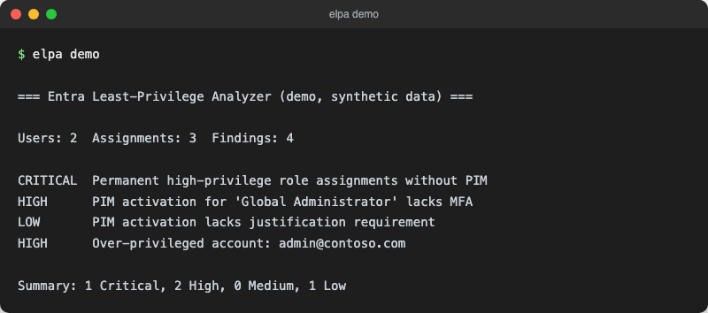

<div align="center">
  

  <h1>Entra Least-Privilege Analyzer</h1>
</div>

> 🇬🇧 [English Version](README.md)

**Read-only Rust CLI zur Analyse von Entra ID Berechtigungskonfigurationen, Erkennung überprivilegierter Accounts, Rollen-Overlap und PIM-Lücken.**

Der Entra Least-Privilege Analyzer verbindet sich per Anwendungsberechtigungen mit der Microsoft Graph API und erstellt einen strukturierten Berechtigungsbericht. Vollständig read-only, keine Daten verlassen das lokale Gerät.

Konzipiert für Zero-Trust-Umgebungen. Ausgerichtet an den Identity-Controls des [Microsoft Cloud Security Benchmark (MCSB)](https://learn.microsoft.com/de-de/security/benchmark/azure/overview) und den Microsoft Secure Score Empfehlungen.

[](https://github.com/9t29zhmwdh-coder/entra-least-privilege-analyzer/actions)      [](https://github.com/9t29zhmwdh-coder/entra-least-privilege-analyzer/releases) [](LICENSE)

> **So läuft das:** Das ist ein Kommandozeilen-Tool, keine Desktop-App und kein Server. `elpa` läuft pro Befehl einmal durch und beendet sich; es gibt keinen Installer und keinen Hintergrundprozess. Mit `elpa demo` siehst du es gegen einen eingebauten synthetischen Mandanten laufen, ganz ohne Entra-ID-Zugangsdaten.



---

> 🌱 Neu hier? → [Schritt-für-Schritt-Anleitung für Einsteiger](GETTING_STARTED.md)

---

**In der Praxis:** Du bekommst eine CLI, die sich read-only mit deinem Mandanten verbindet und eine priorisierte Liste an Berechtigungsrisiken (überprivilegierte Accounts, Rollen-Overlap, PIM-Lücken) direkt ins Terminal ausgibt, oder als JSON/Markdown für Tickets und Audits exportiert.

## Funktionen

| Funktion | Beschreibung |
|---|---|
| Privilege Scoring | Gewichtete Punktzahl pro Account basierend auf gehaltenen Rollen |
| Erkennung überprivilegierter Accounts | Flaggt Accounts über konfigurierbare Score-Schwellenwerte |
| Rollen-Overlap-Analyse | Erkennt redundante oder konfliktbehaftete Rollenzuweisungen |
| PIM-Lückenerkennung | Erkennt permanente Hochprivileg-Zuweisungen und schwache PIM-Einstellungen |
| PIM-Einstellungsaudit | Prüft MFA-Anforderung, Begründungspflicht, maximale Aktivierungsdauer |
| JSON / Markdown Export | Strukturierte Ausgabe für Tickets, Audits und Dokumentation |
| SARIF-Stub | Vorbereitet für GitHub Advanced Security Integration (v0.2) |

---

## Benötigte Graph API Berechtigungen

Registriere eine Anwendung in Entra ID mit folgenden **Anwendungsberechtigungen** (nicht delegiert):

| Berechtigung | Zweck |
|---|---|
| `Directory.Read.All` | Benutzer und Gruppenmitgliedschaften lesen |
| `RoleManagement.Read.All` | Rollendefinitionen und Zuweisungen lesen |
| `PrivilegedAccess.Read.AzureAD` | PIM Eligible und Active Assignments lesen |
| `Policy.Read.All` | Rollenverwaltungsrichtlinien und PIM-Einstellungen lesen |

Alle Berechtigungen sind **read-only**. Es werden keine Schreibberechtigungen benötigt oder verwendet.

---

## App-Registrierung einrichten

1. Im [Azure Portal](https://portal.azure.com) zu **Entra ID > App-Registrierungen > Neue Registrierung** navigieren
2. Anwendung benennen (z.B. `elpa-analyzer`) und registrieren
3. Unter **API-Berechtigungen** die vier oben genannten Berechtigungen hinzufügen
4. Administratorzustimmung für den Mandanten erteilen
5. Unter **Zertifikate & Geheimnisse > Neuer geheimer Clientschlüssel** den Wert kopieren
6. **Mandanten-ID**, **Client-ID** und **Geheimer Clientschlüssel** notieren

---

## Schnellstart

```bash
git clone https://github.com/9t29zhmwdh-coder/entra-least-privilege-analyzer
cd entra-least-privilege-analyzer
cargo build --release

# Ohne Zugangsdaten testen, gegen einen eingebauten synthetischen Mandanten
./target/release/elpa demo

# .env erstellen und Zugangsdaten für einen echten Mandanten eintragen
cp .env.example .env

# Vollständige Analyse
./target/release/elpa analyze

# Nur PIM-Analyse
./target/release/elpa pim

# Export als Markdown
./target/release/elpa export --format md --output bericht.md

# Export als JSON
./target/release/elpa export --format json --output bericht.json
```

---

## Deinstallation / Datenbereinigung

Lösche das `target/` Build-Verzeichnis, deine lokale `.env`-Datei (enthält deinen Client-Secret) und exportierte Report-Dateien (`bericht.md`, `bericht.json`). Das Tool ist read-only gegenüber Entra ID und schreibt nie etwas in deinen Mandanten zurück.

---

## Konfiguration

`.env` Datei im Projektverzeichnis anlegen:

```env
ENTRA_TENANT_ID=deine-mandanten-id
ENTRA_CLIENT_ID=deine-client-id
ENTRA_CLIENT_SECRET=dein-clientschluessel
```

Die `.env`-Datei ist in `.gitignore` aufgeführt. Zugangsdaten werden nie committet.

### Alternative: Eigenen Token mitbringen

Wer bereits einen gültigen Microsoft-Graph-Access-Token besitzt (z.B. aus
einem Admin-Portal mit delegierter Anmeldung), kann den Client-Credentials-
Flow überspringen:

```env
ENTRA_TENANT_ID=deine-tenant-id
ENTRA_ACCESS_TOKEN=eyJ0eXAi...
```

Der Token wird unverändert genutzt und nicht erneuert, gedacht für
Einzelläufe, bei denen der Aufrufer die Token-Lebensdauer verwaltet.
`ENTRA_CLIENT_ID`/`ENTRA_CLIENT_SECRET` sind in diesem Modus nicht nötig.


---

## Schweregrade der Befunde

| Stufe | Bedeutung | Beispiele |
|---|---|---|
| Critical | Sofortiger Handlungsbedarf | Permanenter Global Admin ohne PIM |
| High | Im nächsten Sprint beheben | PIM ohne MFA, überprivilegierter Account |
| Medium | Innerhalb von 30 Tagen beheben | Rollen-Overlap, langer PIM-Aktivierungszeitraum |
| Low | Best Practice Verbesserung | Fehlende Begründungspflicht |

---

## Voraussetzungen

- Rust 1.78+
- Entra ID Mandant mit App-Registrierung
- Netzwerkzugang zu `login.microsoftonline.com` und `graph.microsoft.com`

---

**Autor:** [Rafael Yilmaz](https://github.com/9t29zhmwdh-coder) · **Status:** Active ·  · **Lizenz:** MIT
